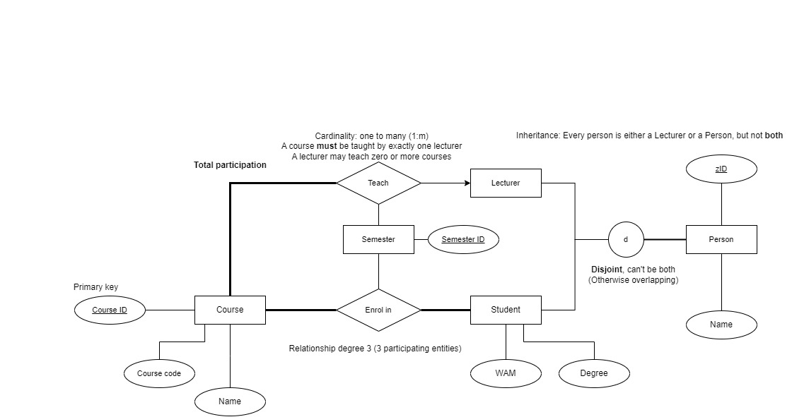

# Tut02

## Announcements

- [Assessments](https://www.unsw.edu.au/course-outlines/course-outline#year=2024&term=Term%201&deliveryMode=Multimodal&deliveryFormat=Standard&teachingPeriod=T1&deliveryLocation=Kensington&courseCode=COMP3311&activityGroupId=1)
  - Quiz01 due Friday, 23 February 2024 at 11:59PM
- Practice Exercises and Tutorial Exercises aren't marked, but it's important you do them!
  - Do Practice Exercise 01 **immediately**: set up PostgreSQL, required for assignments and exams

## Today: Data Modelling

Requirements -> ER Model -> Relational Model -> Database Schema

### ER Model

- High-level conceptual level model which translates real world objects & requirements into:
- 3 key constructs: Entities, Relationships, Attributes
- Q6, Q9, Q10

- One thing I missed during the tutorial (:/): Student and Lecturer entities **inherit** from Person
  - This ensures zID is unique across students and lecturers, which wouldn't be the case without inheritance

## Relational Model

- Obtained by **ER-Relational Mapping** (covered in Week 2 Lectures & next tutorial)
- 1 key constructs: Relations (which are **tables**)
- Tuples are table rows
- Primary key must be unique and not null
- Q16, Q18, Q19
